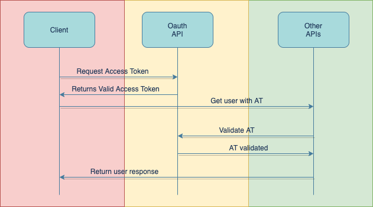

# bookstore_oauth-api

authentication Service

## Overview
In order to securitize our applications, sometimes we require to authenticate users before allowing them to enter and interact with our system.

## Login and authentication flow
First, a user request an access token to the OAuth api and this returns the access token (AT).
Then, there is other API that require validate this AT, and in the case that the user was validate, this return the validation.

## Project Structure
This app use Domain Driven Development design, a hexagonal architecture and Casandra database to persiste the users access token.

 